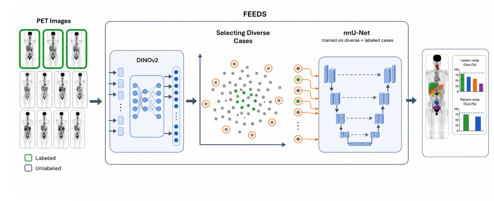

# FEEDS: Foundation model-Enabled Efficient Data Sampling

**A label- and compute-efficient training strategy for pan-cancer, multi-tracer whole-body PET/CT lesion segmentation.**

  

---

## Overview
Automated lesion segmentation in whole-body PET/CT images can help clinicians in cancer detection, staging, and treatment planning, across radiotracers and cancer types, particularly as imaging volume increases exponentially without a corresponding increase in nuclear medicine specialists. However, training lesion segmentation models requires large annotated datasets. Annotation is time- and expertise-intensive, and challenging with variability in lesion size, distribution, and appearance, as well as the fact that lesion segmentation is not part of routine clinical workflow. 

As a result, models trained on limited labeled PET/CT data often lack the accuracy and generalizability needed for clinical use. We present FEEDS (Foundation model-Enabled Efficient Data Sampling), a label- and compute-efficient learning strategy that uses vision foundation model embeddings to select the most informative and diverse unlabeled cases for expert annotation. Unlike unsupervised, semi-supervised, and active learning approaches, FEEDS is a one-step training paradigm requiring only a limited, representative training set, making it label- and compute-efficient. 

We train and validate FEEDS using the AutoPET-III dataset (103 labeled and 940 unlabeled cases for training, 247 labeled for validation; pan-cancer, multi-tracer). We test its accuracy and generalizability on three held-out sets: AutoPET-III (N=322; FDG and PSMA; lung, lymphoma, melanoma, prostate, no-cancer), DeepPSMA (N=200; FDG and PSMA; prostate cancer), and an internal Dartmouth-Hitchcock Medical Center dataset (N=23; PSMA; prostate and no-cancer). We evaluate clinical utility at the voxel, lesion, and anatomic region level to assess performance in high-risk areas and treatment planning utility. 

FEEDS outperforms random-sampling-based labeling, pseudolabel-based semi-supervised learning, and training with limited labeled data alone. It generalizes across all three test sets, FDG and PSMA tracers, and multiple diseases, matching fully-labeled (100\%) training performance with 70\% less annotation burden. FEEDS offers a practical tool for improving lesion detection by building representative, diverse annotation queues from large unannotated clinical repositories.

---

## Method

FEEDS achieves label- and compute-efficient segmentation in three steps (see figure above):

1. **Foundation model feature extraction.** For each 3D PET volume, a z-axis maximum-intensity projection (MIP) is computed, z-score normalized, and passed through a pretrained **DINOv2** encoder to obtain an image-level token representation `f ∈ ℝ⁷⁶⁸`.

2. **FEEDS Sampling.** Selection is performed **independently per tracer type** (FDG, PSMA), since the two form distinct clusters in feature space. For each unlabeled case, its minimum cosine distance to the tracer-matched labeled pool is computed. Within each tracer group, the farthest *X%* of cases are selected for annotation, preserving the FDG:PSMA ratio and prioritizing underrepresented scan patterns (rare cancer types, unusual uptake distributions).

3. **Segmentation model training.** The FEEDS-selected diverse cases are annotated, added to the fixed labeled pool, and used to train an **nnU-Net** model for whole-body lesion segmentation.

---

## Data

Development and validation used the pan-cancer, multi-tracer **AutoPET-III** dataset: 1,043 training scans (103 fixed labeled ≈ 10%, 66 FDG / 37 PSMA; 940 unlabeled) and 247 validation scans. Splits keep each patient's longitudinal scans in a single partition to prevent leakage.

Accuracy and generalizability were tested on three held-out sets:

| Test set | N | Tracers | Diseases |
|---|---|---|---|
| **AutoPET-III** | 321 | FDG, PSMA | Lung, lymphoma, melanoma, prostate, no-cancer |
| **DeepPSMA** | 200 | FDG, PSMA | Prostate cancer |
| **DHMC** (internal, Dartmouth-Hitchcock Medical Center) | 23 | PSMA | Prostate, no-cancer |

> **Note on data access.** AutoPET-III and DeepPSMA are publicly available from their respective sources. The DHMC dataset is an internal, de-identified dataset and is not publicly released.

## Baselines Compared

- Random-sampling-based labeling (with 5-iteration variability analysis at fixed budget)
- Determinantal Point Process (DPP) sampling on the same foundation model features
- Iterative pseudo-label-based semi-supervised learning
- Limited-labeled-data (10%) and fully-labeled (100%) training

---

## Authors & Affiliations

Biratal R. Wagle¹, Bashirul A. Biswas¹, Grant Chau¹, Marc A. Seltzer², Matthew E. Maeder², James B. Yu³, Indrani Bhattacharya¹ (corresponding author: `Indrani.Bhattacharya@dartmouth.edu`)

1. Department of Biomedical Data Science, Geisel School of Medicine, Dartmouth College
2. Department of Radiology, Dartmouth-Hitchcock Medical Center
3. Department of Radiation Oncology, Dartmouth-Hitchcock Medical Center

---
---

## Acknowledgments

Built on [DINOv2](https://github.com/facebookresearch/dinov2) and [nnU-Net](https://github.com/MIC-DKFZ/nnUNet). We thank the maintainers of the AutoPET-III and DeepPSMA challenge datasets.
